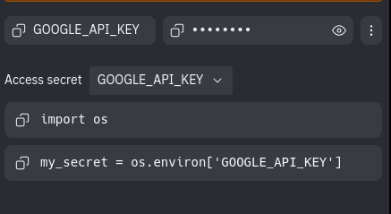

# Gemini AI ChatBot INFO

This is a working gemini chatbot. it uses google gemini to generate responses.

```python
#Breakdown of the code
import os
import google.generativeai as genai
#Imports resources ^^^

# Or use `os.getenv('GOOGLE_API_KEY')` to fetch an environment variable.
GOOGLE_API_KEY = os.getenv('GOOGLE_API_KEY')
#Gets a google API key to contact and verify user so you can use gemini ^^^
genai.configure(api_key=GOOGLE_API_KEY)
#Sets up the API Key ^^^
for m in genai.list_models():
  if 'generateContent' in m.supported_generation_methods:
    print(m.name)
#It gets a list of all the available AI models from the genai library. 
#It loops through each model (m).
#If the model supports "generateContent" (meaning it can generate text), it prints the model's name.
#Once it finds a model that supports "generateContent", it stops searching for further models (break). ^^^
model = genai.GenerativeModel(model_name="gemini-pro")
#Chooses the model for the ai to use, keep gemini pro so that you can have long multi line awnsers EG,
#line1:Hello im gemini
#Line2:this is an example
#Line3:It doesnt really look like this but you get the point


while True:
# Main loop to keep prompting the user
    
  user_prompt = input("What would you like to ask Gemini? ")
  # Get user input (Asks user question)
 
    response = model.generate_content(user_prompt)
   # Generate content based on user input  ^^^ 

    parts = response.parts
  # Access the parts of the response so that it can print ^^^

    for part in parts:
        print(part.text)
        print( )
        print( )
        # Print each part of the response and also adds a spacer ^^^
```


To-DO
- Create Framework For API - Complete
- Create Visual Responce - In Progress